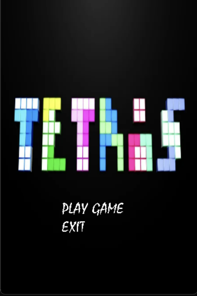
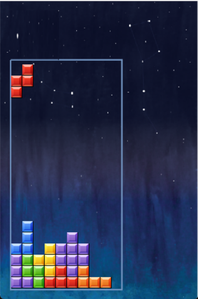

- [SDL2 TETRIS](#sdl2-tetris)
  - [Description](#description)
  - [Instruction](#instruction)
  - [Dependencies](#dependencies)
  - [How to build](#how-to-build)

# SDL2 TETRIS

  This is a simpler clone of Tetris written in C++ using SDL2
  
***
---
## Description
 The objective of the game is to rotate and move tetrominoes so that they fit together to form complete rows. When a row is completed, it disappears and any blocks above it fall down to fill the space. The game ends when the blocks reach the top of the screen and there is no more room for new tetrominoes to fall.

 
 ***
 ## Instruction

- Arrow left/right - Move left/right
- Arrow up - Rotate( clockwise )
- Arrow down - Soft Drop
- Space - Hard Drop
- M - Mute
- N - Mnmute
- ESC - Quit

***
  ## Dependencies

  1. [Standard C++ compiler](https://en.wikipedia.org/wiki/List_of_compilers#cite_ref-15) conforming to C++17 and above standards: to build the project locally 
  2. [SDL2.0 library](https://github.com/libsdl-org/SDL): for rendering stuff on screen.
1. [SDL TTF library](https://github.com/libsdl-org/SDL_ttf): for rendering font from TrueType (.ttf) font files.
2. [SDL2 Mixer library](https://github.com/libsdl-org/SDL_mixer): for rendering music and sound effects.
3. [SDL2 images](https://github.com/libsdl-org/SDL_image): for rendering images on screen.
 ---

  ## How to build
  
  1. make sure you have installed SDL2, SDL2image, SDL2mixer, SDL2ttf.
  2. clone this repository using command line
   ```c
   git clone https://github.com/Thinhtrang/Tetris2023.git
   ```
   3. open the command line and run 
   ```c
   $ g++ -std=c++17 textObject.cpp tetris.cpp main.cpp -O2 -lSDL2_image -lSDL2mixer -lSDL2_ttf -lSDL2
   ```
   ---


